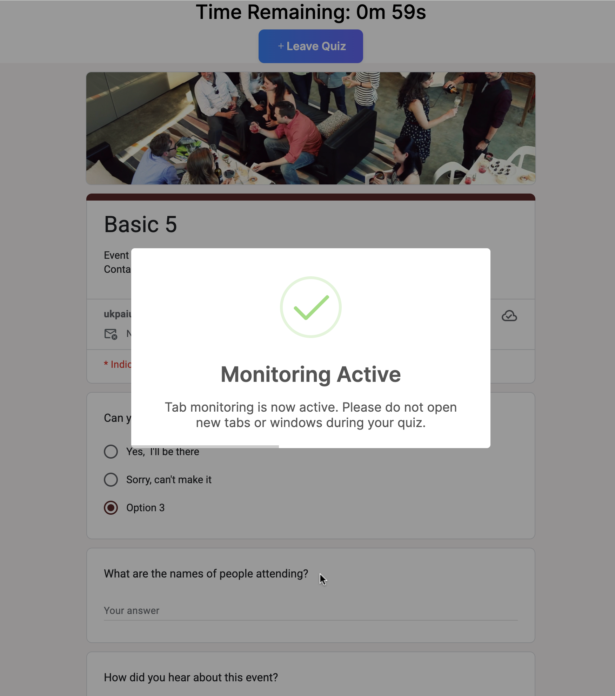
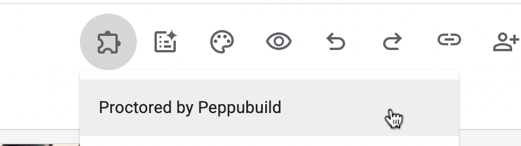
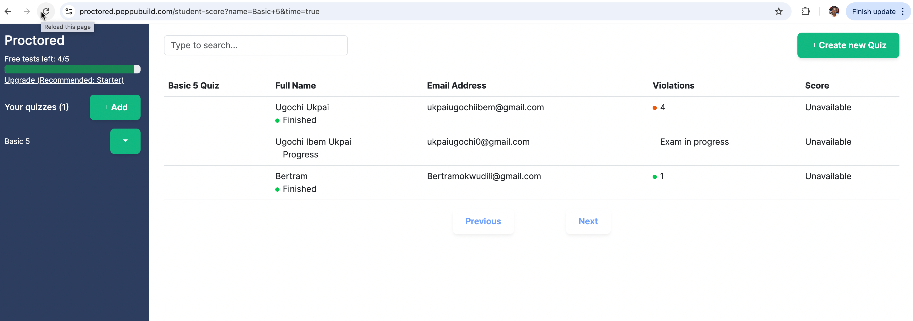

In this tutorial, we will explore how to create a timed Google Form. While Google doesn't provide a means for implemmenting this, you can use an add-on or write an Apps Script that introduces a timer.

---
# Table of Contents
1. [Why Use a Timer](#Wwhy-use-a-timer)
2. [Writing a Timer with Apps Script](#writing-a-timer-with-apps-script)
3. [Proctored Add-on as the Perfect Solution](#proctored-add-on-as-the-perfect-solution)

## Why Use a Timer?

Google Forms are often used as a tool for questionaire and sometimes for writing quizzes, especially when used together with Google Classroom. While closing the form at a [certain time (avoid receiving response)](https://blog.peppubuild.com/posts/form-timer) may work for questionaires, it is not always the case for quiz.

For instance, you may need students to spend a maximum of twenty minutes for a quiz, while keeping the Form open for a few days so that they can take it at the time of their convienience. In this case, you will need a timer in Google Form. Let's explore how we can create our Google Form timer.

## Writing a Timer with Apps Script

One method of adding functionalities not readily present in [Google Workspace (Google Forms, Google Sheet, Google Drive, Google Docs, Google Classroom, etc.)](https://workspace.google.com/) is by writing it in Apps Script. [Apps Script](https://developers.google.com/apps-script), is Google's scripting that integrates with and automate tasks across Google Workspace Platform. The problem with this platform, is that you need to be proeficient with JavaScript or at least understand how coding works. If you understand how programming works, let us create our timer function.

First, click on the menu button as shown in the image below. Now, scroll down to Apps Script and click on it.


You will be taken to your Apps Script workspace. While the App Script is not named,you already have a function in the code.gs file. Remove the existing code and add the code below to it.

```js
// This function reads the index file as well as sets XFrameOptions
function doGet() {
  return HtmlService.createHtmlOutputFromFile('index')
  // The setXFrameOptionsMode Apps Script method sets the header to SAMEORIGIN
    .setXFrameOptionsMode(HtmlService.XFrameOptionsMode.ALLOWALL);
}
```

Now, this function will read an `index.html` file while adding the Form content as an iFrame. The advantage of doing this with Apps Script instead of an external site is that Google acknowledges it as **SAMEORIGIN** Since we don't have an `index.html` file yet, we will create one and add the code below into it.

```html
<!DOCTYPE html>
<html>
  <head>
    <base target="_top">
    <style>
      body {
        font-family: Arial, sans-serif;
        text-align: center;
        padding: 20px;
        background: #f9f9f9;
      }
      #timer {
        font-size: 2rem;
        margin: 1rem auto;
        color: #333;
      }
      #overlay {
        position: fixed;
        top: 0; left: 0;
        width: 100%; height: 100%;
        background: rgba(0, 0, 0, 0.85);
        color: white;
        display: none;
        justify-content: center;
        align-items: center;
        font-size: 1.5rem;
        z-index: 9999;
        flex-direction: column;
        padding: 20px;
      }
      iframe {
        width: 100%;
        height: 80vh;
        border: none;
        margin-top: 10px;
      }
    </style>
  </head>
  <body>
    <!---Hard coded time as 4 minutes for the form-->
    <div id="timer">⏳ Time left: 4:00</div>

    <!---Form's content is added in an iframe-->
    <iframe
      src="https://docs.google.com/forms/d/e/YOUR_FORM_ID/viewform?embedded=true"
      allowfullscreen>
    </iframe>

    <!---Student is notified that time is up-->
    <div id="overlay">
      <p>⏰ Time is up!</p>
      <p>You can still submit your form if you haven’t yet.</p>
    </div>

    <script>
      let timeLeft = 4 * 60; // 4 minutes in seconds
      const timerElement = document.getElementById('timer');
      const overlay = document.getElementById('overlay');

      const interval = setInterval(() => {
        const minutes = Math.floor(timeLeft / 60);
        const seconds = timeLeft % 60;
        timerElement.textContent = `⏳ Time left: ${minutes}:${seconds < 10 ? '0' : ''}${seconds}`; // hard coded time now on countdown
        
        timeLeft--;

        if (timeLeft < 0) {
          clearInterval(interval);
          overlay.style.display = 'flex';
        }
      }, 1000);
    </script>
  </body>
</html>
```

Now, you can deploy this as a web application, share the link with your students to take their timed tests.

```txt
// Deploy as Web App
1. Go to Deploy > Manage deployments.

2. Click New Deployment, choose Web App.

3. Set access to "Anyone" (or "Anyone with link").

4. Click Deploy and open the URL.
```

The problem with this method is that you will not know if the student exceeds their time except you attach the Form to a Google Sheet. Even with this, you still can not find out how many questions they answered before their time was up (the most you can do is disqualify everyone that exceeds their time.) Since there's no Apps Script class to force submit, you can not force the student to submit when their time is up. Finally, the student can retake their test, as they're no stringent rule to stop them from doing that.

This is why educators use add-ons like [Proctored](https://proctored.peppubuild.com). Here, you can set timer and monitor tests the right way. Let's explore how to do this.

## Proctored Add-on as the Perfect Solution

Proctored allows you to monitor exams the right way, and automatically evaluate students. First, navigate to Google Marketplace and install [Proctored by Peppubuild](https://workspace.google.com/marketplace/app/proctored_by_peppubuild/890175963480). Now, in any Form of your choice, click on the add-on menu and choose Proctored by Peppubuild as shown in the image below.



Now, click on the "Configure Exam Settings", a sidebar will open with an option to add exam duration in minutes. Follow the guide from the sidebar and the Form will be added to your Prctored dashboard. Hence, you can share the quiz link with your students. With this, you can determine how long a quiz should last, view who has taken the tests, their attempts on cheating as well as their score.



## Conclusion
In this article, we have explored the creation of timers in Google Forms. From writing our functions in Apps Script, to utilising the Proctored add-on. The table below, shows the pro and cons of each methods.

| Method                    | No Code | Exam monitoring    | Recording attempts          |
|---------------------------|----------------|---------------------|---------------------|
| Google Apps Script        | ❌ No          |  ❌ No             | ❌ No           |
| Proctored Add-on          | ✅ Yes         | ✅ Yes              | ✅ Yes          |


Try out [Proctored by Peppubuild](https://proctored.peppubuild.com) and all of its features as we build a fool-proof proctored exam solutions using Google Forms.

---
**Keywords:** proctored by Peppubuild, Peppubuild exam proctoring, proctor Google Forms, Google Forms proctoring tool,
    online exam proctoring with Google Forms, Peppubuild secure testing, Peppubuild proctored Google Forms,
    how to proctor Google Forms with Peppubuild, best tool to proctor Google Form exams, set time limit and proctor Google Forms,
    Google Forms camera and screen monitoring, remote exam monitoring for Google Forms, Peppubuild exam timer for Google Forms,
    secure student exams using Google Forms, timed Google Forms with screen recording, auto-close Google Forms on time,
    student activity monitoring in Google Forms, Google Form with camera access for exams, Google Forms cheat prevention tools,
    record screen during Google Form exam, teachers proctoring Google Forms, remote learning exam tools,
    secure Google Form for schools, Google Forms for online assessments, online exam tool for students.
